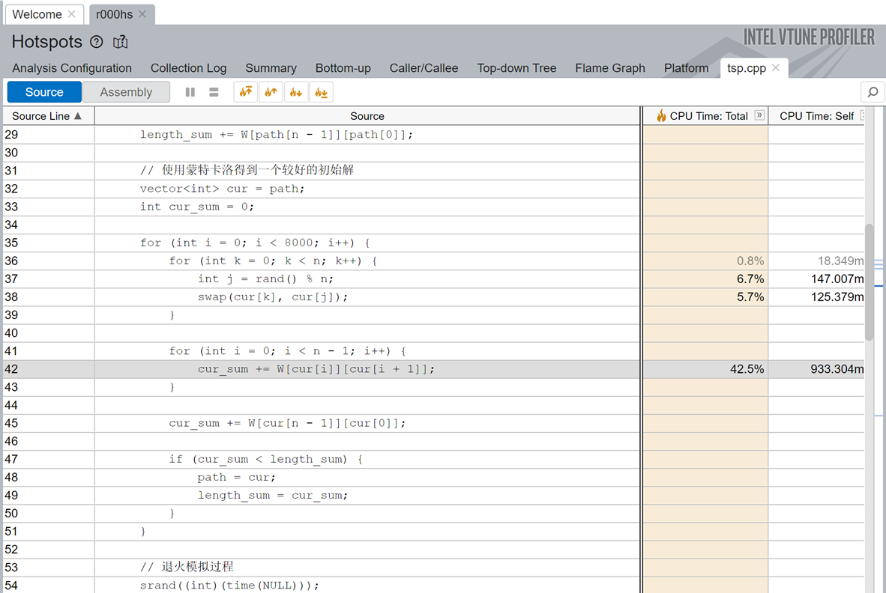
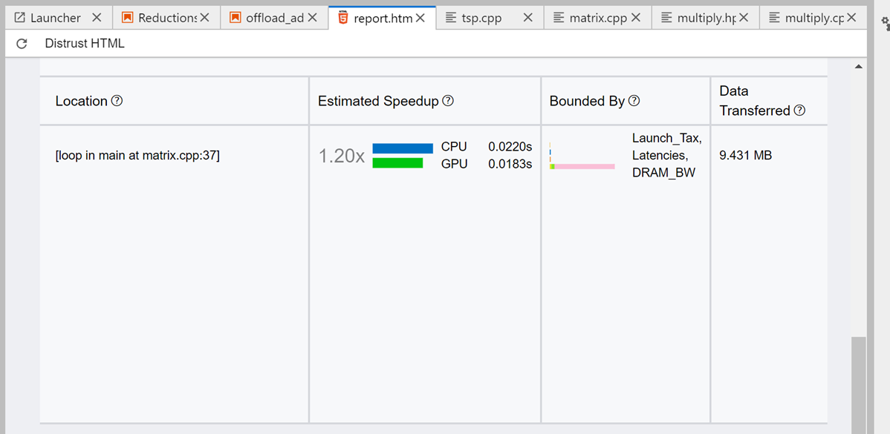
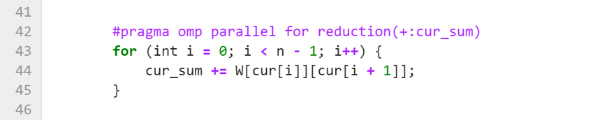
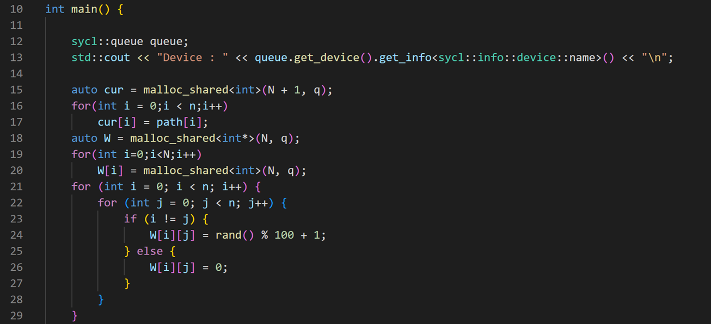
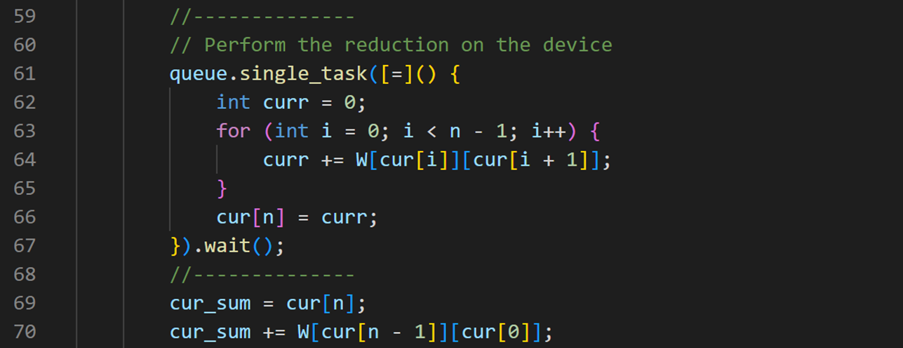
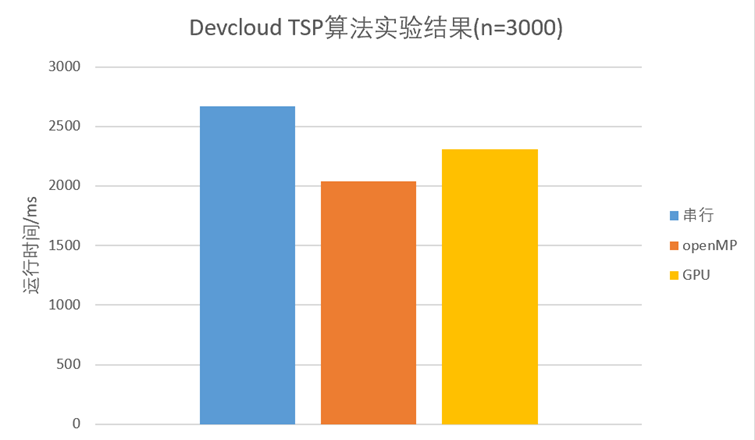
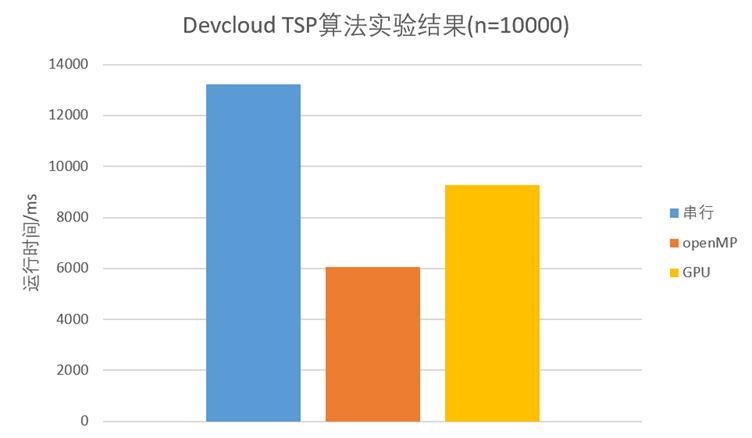

# 使用oneAPI加速模拟退火算法

## 何为模拟退火算法？

模拟退火算法(Simulated Annealing[SA]）来源于固体退火原理，是一种基于概率的算法。
将固体加温至充分高的温度，再让其徐徐冷却，加温时，固体内部粒子随温升变为无序状，内能增大，分子和原子越不稳定。而徐徐冷却时粒子渐趋有序，能量减少，原子越稳定。在冷却（降温）过程中，固体在每个温度都达到平衡态，最后在常温时达到基态，内能减为最小。
模拟退火算法从某一较高初温出发，伴随温度参数的不断下降,结合概率突跳特性在解空间中随机寻找目标函数的全局最优解，即在局部最优解能概率性地跳出并最终趋于全局最优。
模拟退火算法是通过赋予搜索过程一种时变且最终趋于零的概率突跳性，从而可有效避免陷入局部极小并最终趋于全局最优的串行结构的优化算法。

## 模拟退火算法有何应用？
模拟退火算法常用于解决组合优化问题，如TSP、背包问题、作业调度问题等。它能够搜索问题空间中的局部最优解并跳出局部最优解，以找到全局最优解。它最常见的用法可能是代替随机梯度下降算法，在机器学习领域进行参数调整。这部分内容我们在最后一部分也会提到。
需要在大规模搜索空间中找到全局最优解或高质量的解的问题，都可以考虑模拟退火算法。

## 解决思路
我们首先使用Intel® oneAPI系列工具分析串行代码tsp.cpp，以找到决定程序性能的关键代码。

### 使用Vtune分析程序的性能瓶颈
使用Intel® VTune Profiler的Hotspots模式对模拟退火的串行算法进行分析，在编译时加入“-g”选项以便查看对应的源代码。
我们将注意力放在CPU Time较多的代码上，尝试寻找优化空间。

我们发现41\~43行的for循环用时较多。另外71~73行的for循环同样耗费了一定的时间。

### 使用Advisor分析
另外，我们使用Intel® Advisor的Offload Advisor寻找可能使用GPU进行加速的代码段。
最终的报告显示有一个成功offload的循环，实现了1.2倍的加速。我们将基于此进行进一步的优化。

## 并行优化程序
接下来开始进行优化。首先我们发现41~43行、 71~73行同属典型的规约操作，所以考虑使用openMP进行多线程的优化。

另外，Intel® Advisor的报告显示此处代码可以卸载到GPU实现加速，因此我们设计了SYCL程序实现了GPU端的规约。

我们选择USM模型进行主机与设备端的数据传递，首先初始化队列与将要用到的共享内存区。

计算cur_sum时，使用队列提交任务，在设备端进行规约。我们在为cur多分配了一个单位的空间，目的是传递求和信息（图中第66行）。

## 性能分析

### 实验平台
考虑到Intel® DevCloud平台提供了完整的oneAPI支持，可以使用Intel® Advisor、Intel® VTune™ Profiler等功能进行代码分析，Intel® oneAPI DPC++/C++ Compiler进行编译，还可以使用云端的GPU进行加速，所以我们所有的实验都在Intel® DevCloud上进行。

### 实验结果

    

        
    

    

        
    

n=3000时，openMP与GPU均能取得一定的加速(~1.2x)，与Intel® Advisor所得到的加速比相近。当n增大到10000时，openMP能够取得2倍以上的加速，GPU取得的加速比在1.5左右。

此处GPU取得的加速效果不及openMP，主要是因为设备与主机间数据传递开销较大，cur_sum的计算规模较小（O(n)）。

